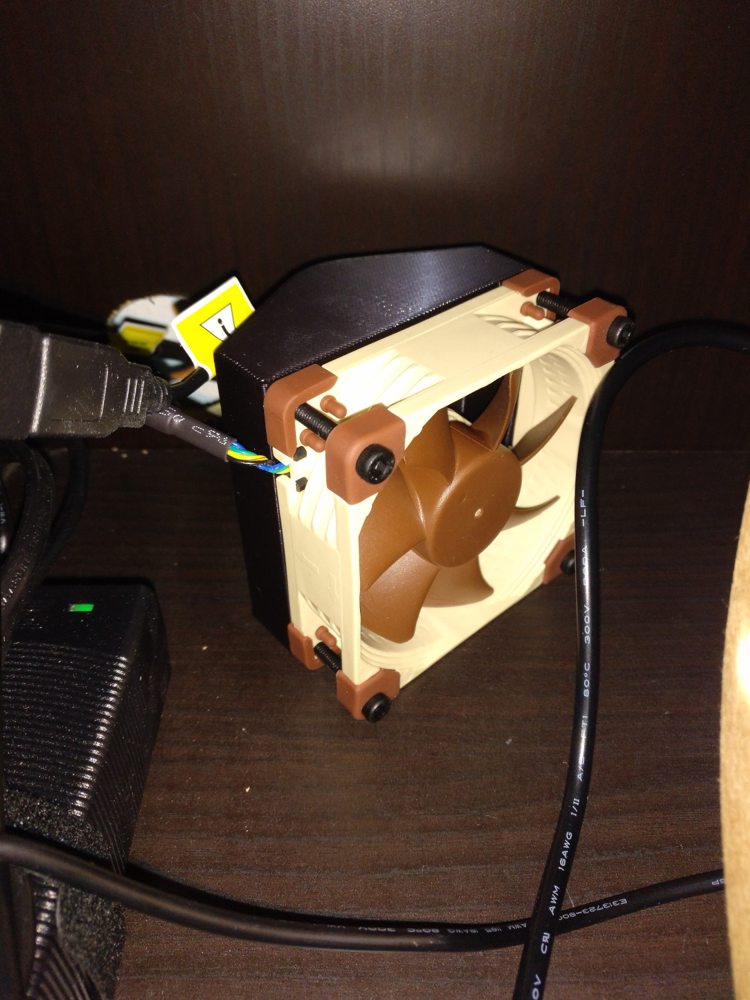
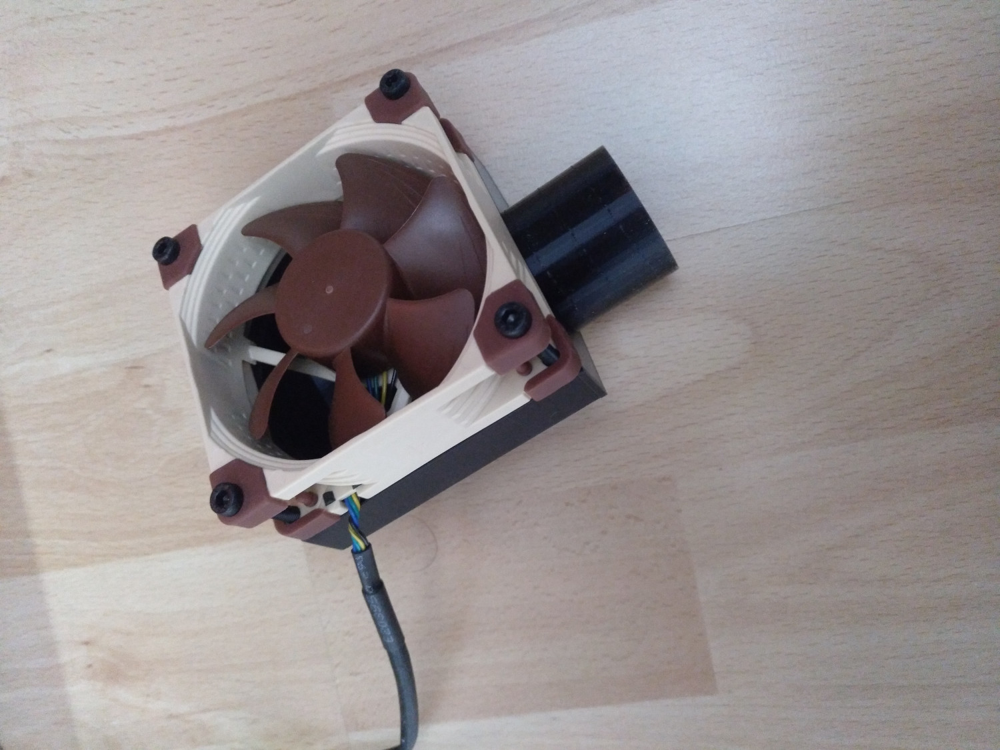
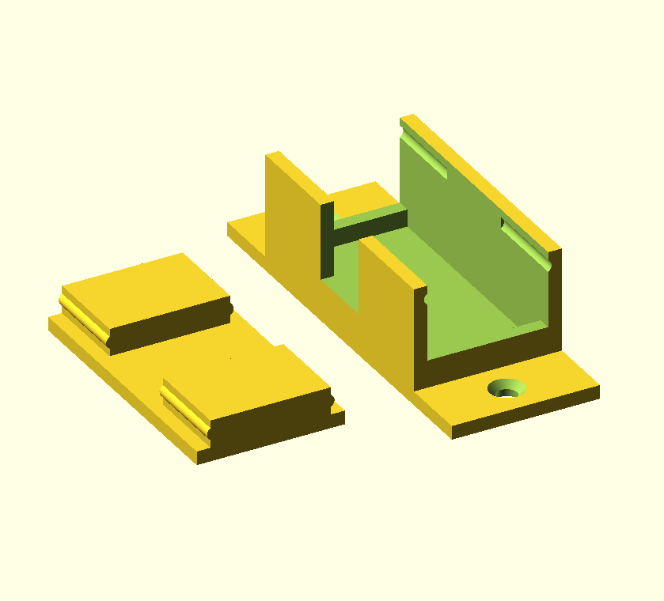
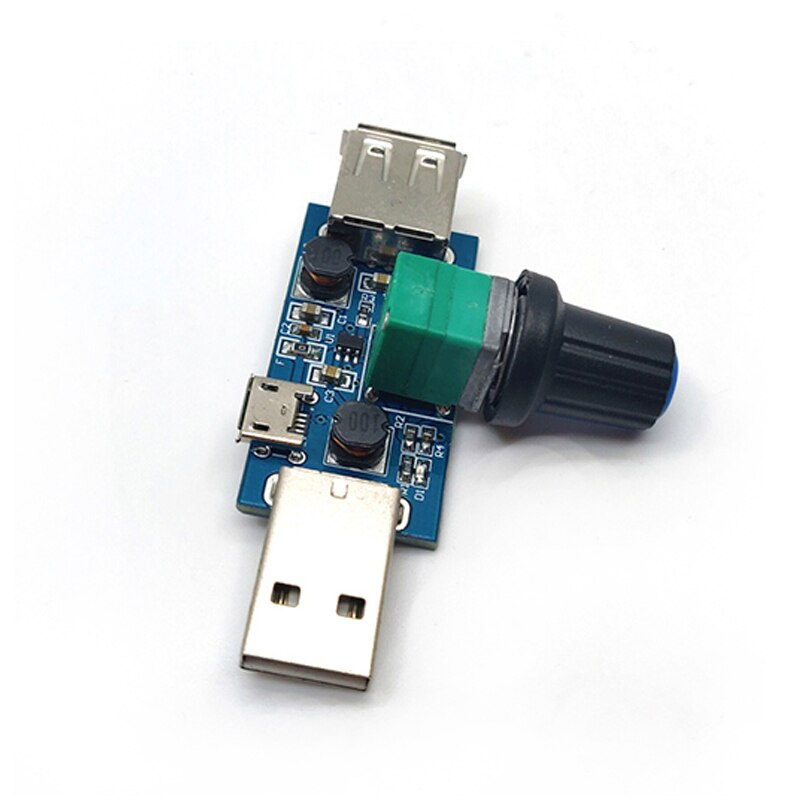
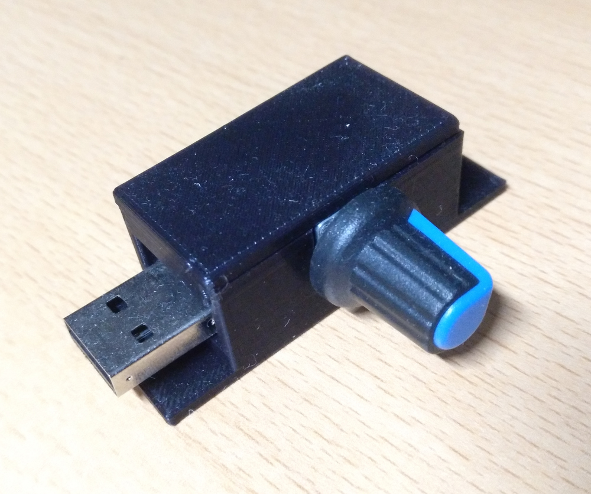
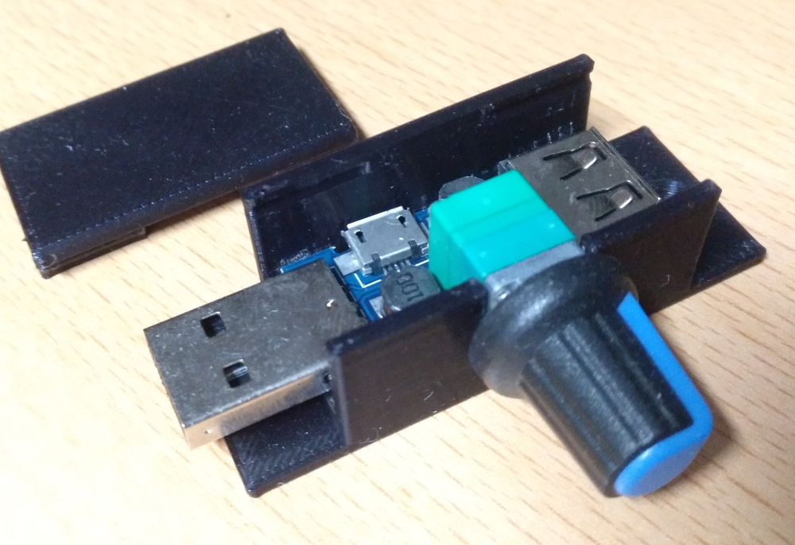

# Air funnel for 80mm Noctua Fan

This is for cooling my 3d printer chambers down. During print the environment temperature rises between 30°C to 35°C (for my MPSM and Prusa Mini). With this, some prints get less quality. Bridging and overhangs are very ugly then. With this I can remove most of the warm air out of the chamber but still can close it to silence the noise of the printer.

Edit: Also may be used as solder fume extractor!

 

 

# Fan Regulator Case

This is an case for a fan regulator pcb which can be found on amazon, ebay, etc. It has a snap-fit and do not need any screws, except you need to mount it somewhere.

# LICENSE

<dl>
 Dieses Werk ist lizenziert unter einer <a rel="license" href="http://creativecommons.org/licenses/by/4.0/">Creative Commons Namensnennung 4.0 International Lizenz</a>.
</dl>

<dl>
 This work is licensed under a <a rel="license" href="http://creativecommons.org/licenses/by/4.0/">Creative Commons Attribution 4.0 International License</a>.
</dl>
