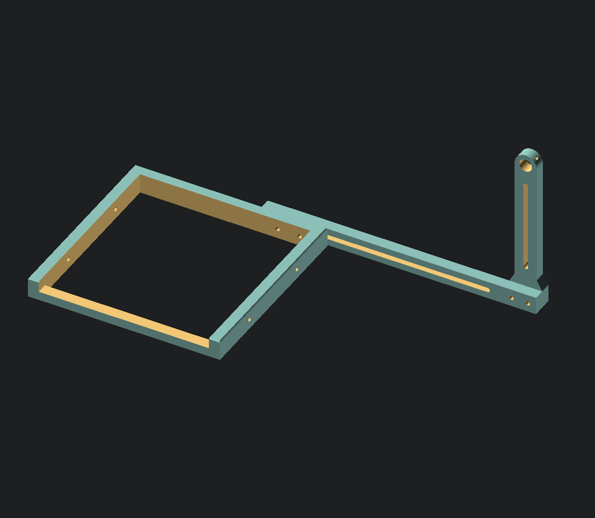
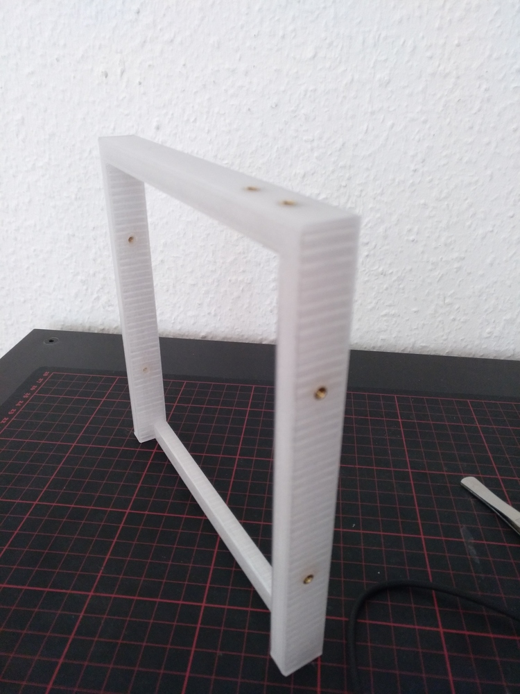
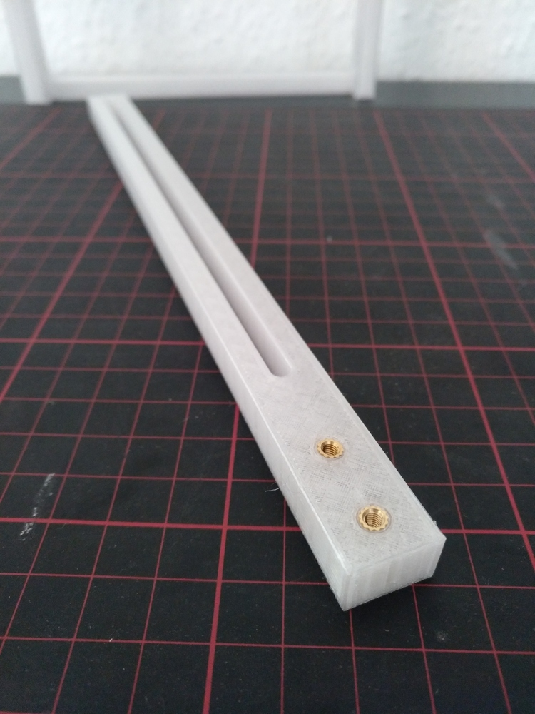
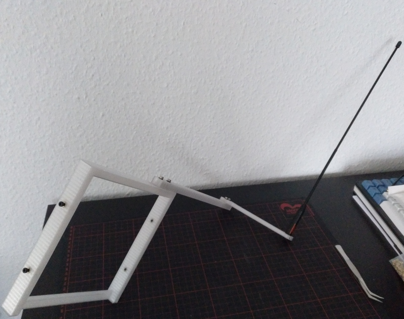
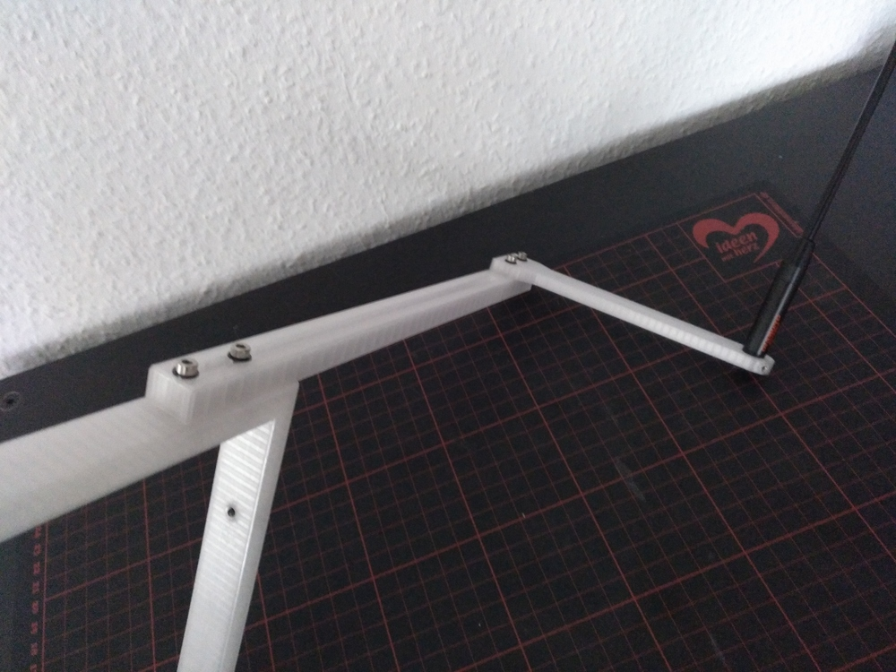
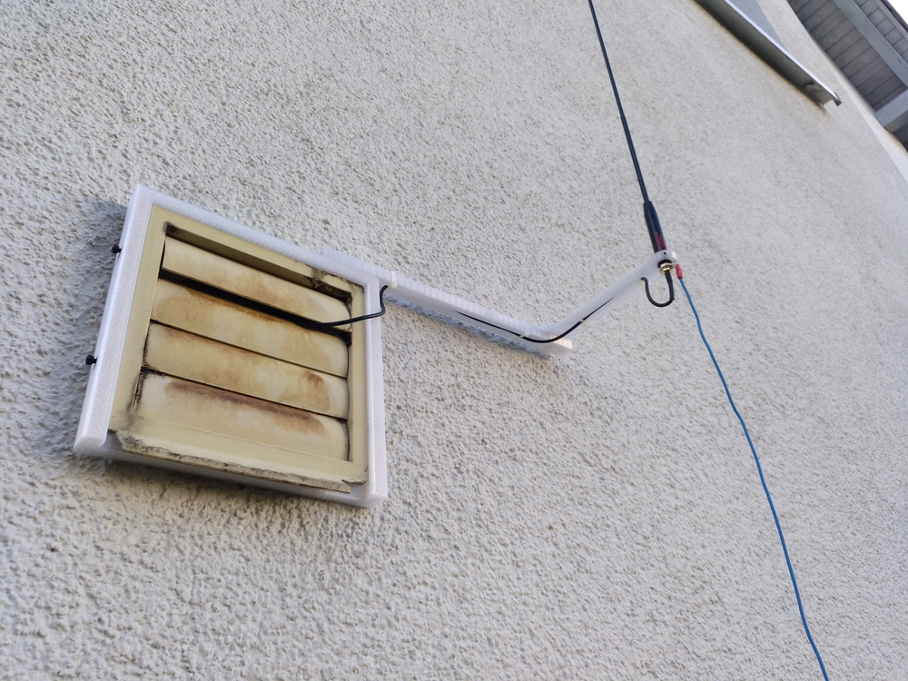
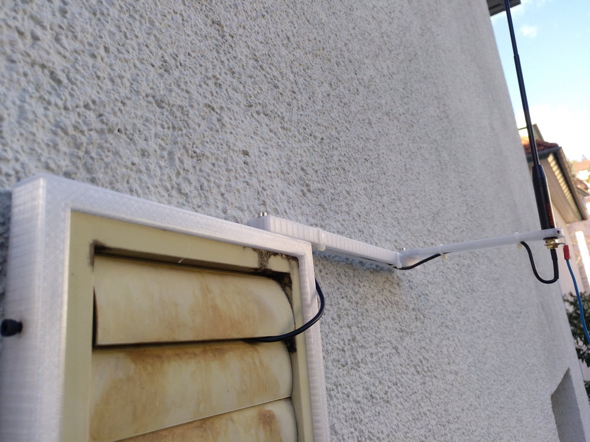
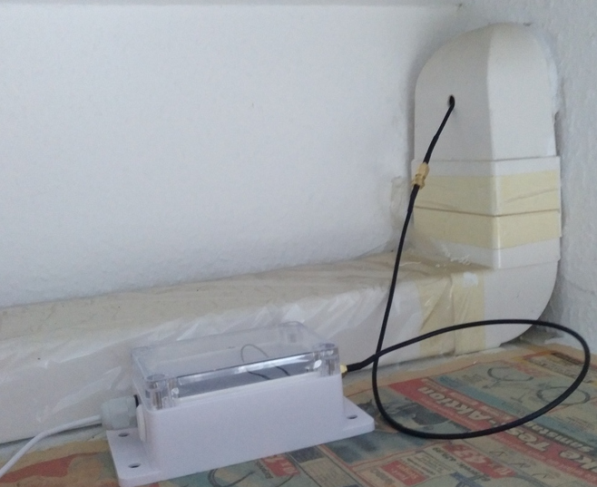

# Antenna holder for Kitchen Air Vents (outside)

This is a frame with extensions for holding antennas (Diamond Antenna Diameter).
I use this to get my TinyGS antenna to the outside. The Controller sits inside
on top of the kitchen sideboard.

 

 

# LICENSE

<dl>
 Dieses Werk ist lizenziert unter einer <a rel="license" href="http://creativecommons.org/licenses/by/4.0/">Creative Commons Namensnennung 4.0 International Lizenz</a>.
</dl>

<dl>
 This work is licensed under a <a rel="license" href="http://creativecommons.org/licenses/by/4.0/">Creative Commons Attribution 4.0 International License</a>.
</dl>
