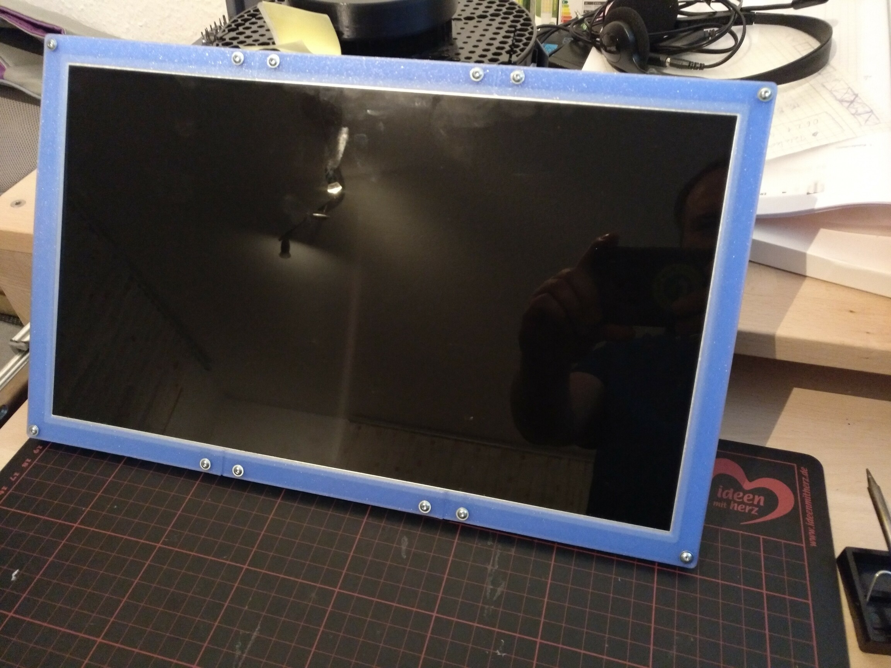
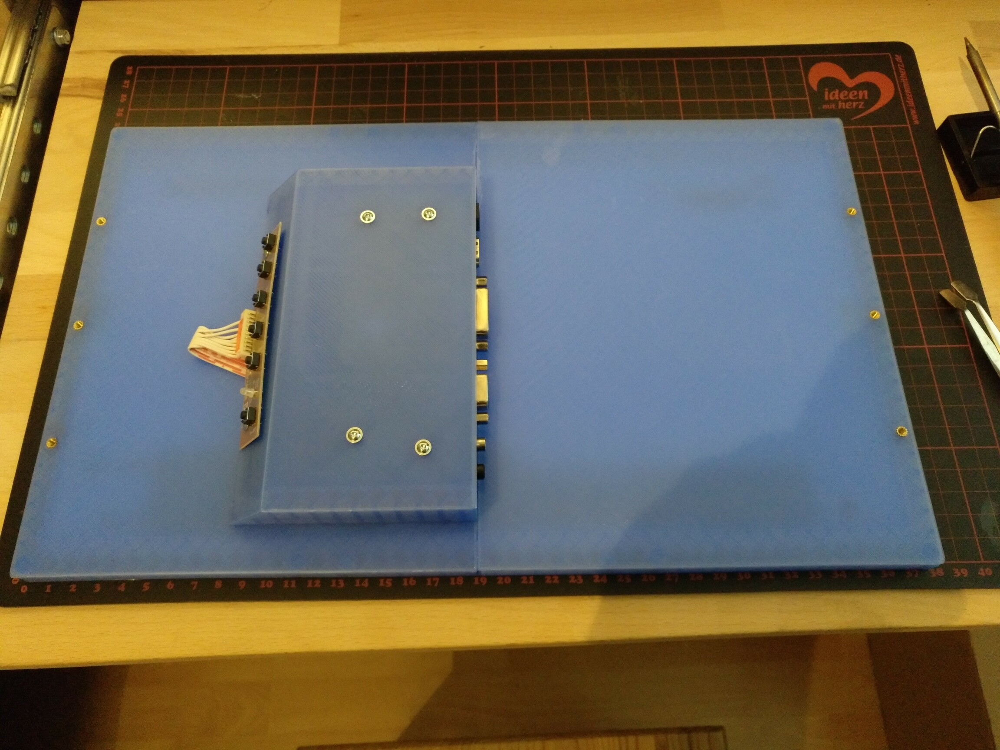
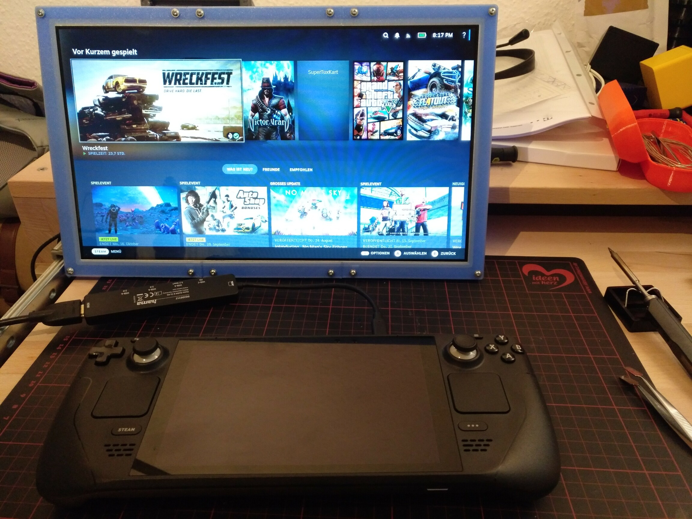

# Laptop Display Casing

WIP!!
ToDos:
- add Building Manual
- add Documentation for Customizer, etc.

__Customizable Case for Laptop Displays which have been removed \/ recycled from old laptops.__

| STL Model | Display | Display Controller | Note |
|-----------|---------|--------------------|------|
| [Display001](stl/display001) | LP156WH2-TLQA | Controller **NT68676** for   LP156WH2-TLQA   N156BGE-L21   N156B6-L04| Display Controller suitable for many displays! Button PCB may be different! |
| [Display002](stl/display002) | LP141WX3 | LCD-Controller **VS-TY2662-V1** for   LP141WX3   B141EW03   LP154W01   LP154WX4   | Display Controller suitable for many displays! Button PCB may be different!    Old display with high voltage backlight! |
| [Display003](stl/display003) | LP156WH4 | LCD-Controller **SKU53004425-1-LCD** for   LP156WH4   LP140WH1  LP156WF1  B156XW02 | Display Controller suitable for many displays! Button PCB may be different! Controller PCB relatively small. |

# Customization

 

 

# LICENSE

<dl>
 Dieses Werk ist lizenziert unter einer <a rel="license" href="http://creativecommons.org/licenses/by/4.0/">Creative Commons Namensnennung 4.0 International Lizenz</a>.
</dl>

<dl>
 This work is licensed under a <a rel="license" href="http://creativecommons.org/licenses/by/4.0/">Creative Commons Attribution 4.0 International License</a>.
</dl>
