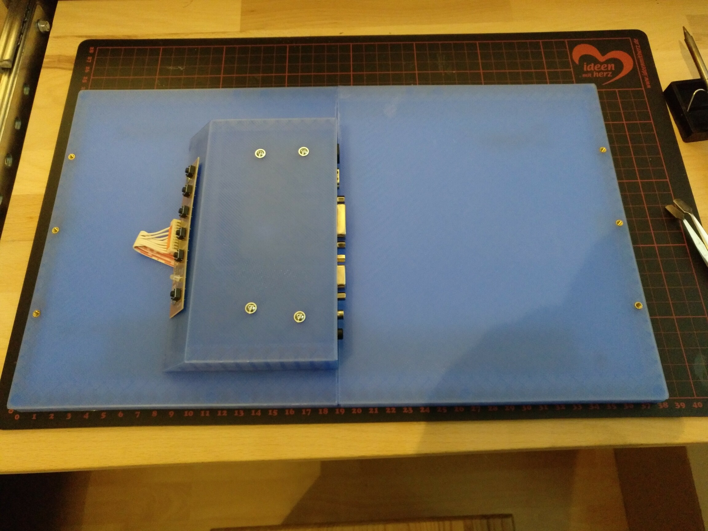

# Laptop Display Casing

WIP!!

Customizable Case for Laptop Displays which have been removed/recycled from old laptops.

| STL Model | Display | Display Controller |
|-----------|---------|--------------------|
| [Display001](stl/display001) |LP156WH2-TLQA / N156BGE-L21 / N156B6-L04 - 15.6 "panel | NT68676 |

 

 

# LICENSE

<dl>
 Dieses Werk ist lizenziert unter einer <a rel="license" href="http://creativecommons.org/licenses/by/4.0/">Creative Commons Namensnennung 4.0 International Lizenz</a>.
</dl>

<dl>
 This work is licensed under a <a rel="license" href="http://creativecommons.org/licenses/by/4.0/">Creative Commons Attribution 4.0 International License</a>.
</dl>
