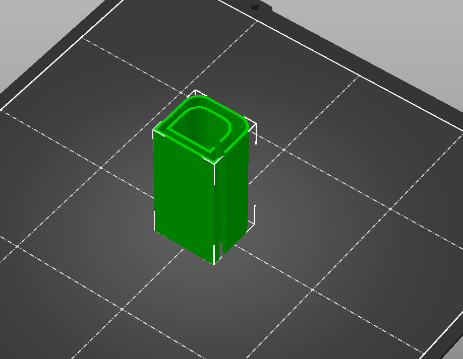
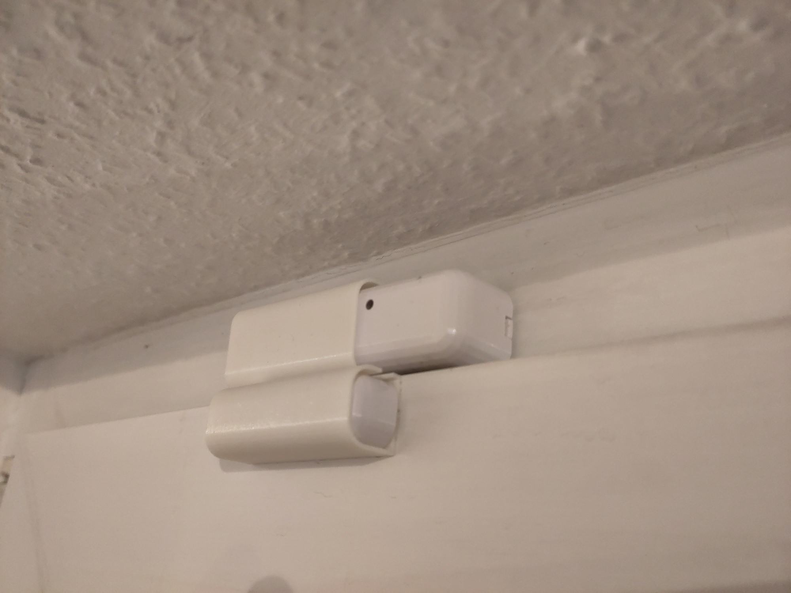
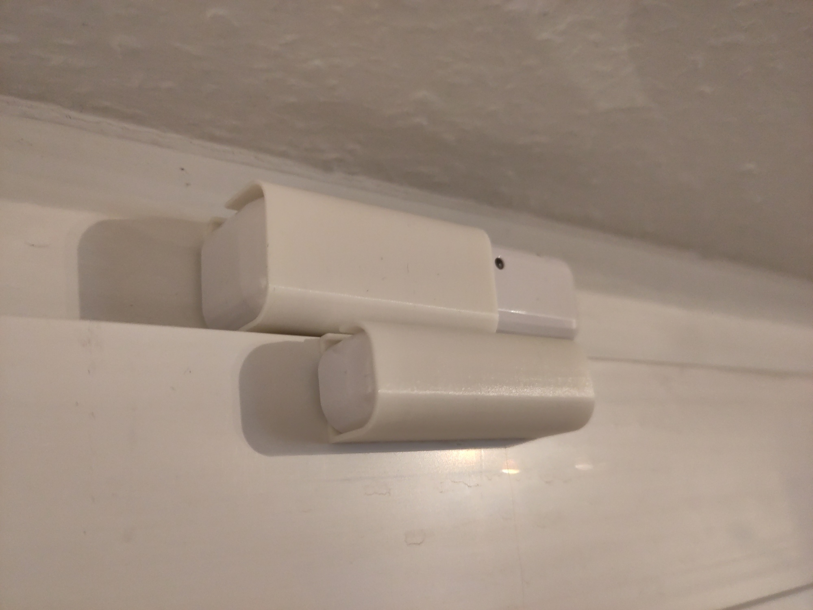
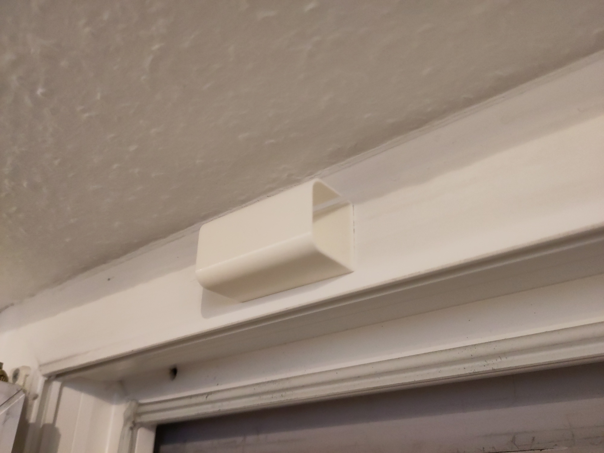

# Shelly Door Window 2 Clamps

These are clamps/holders for the Shelly Door Window 2 Sensors. This avoids sticking the sensors directly to the Window-Frame, which makes the replacement of the batteries much more easy.

It is a good fit if the stickers are still attached. Without the stickers the sensor is very loose in the clamp. Something should be attached to the bottom of the Sensorparts to make them thicker. I designed this espercially for new sensors with stickers attached, to avoid removing them.

I sticked them with some double-sided tape to the window.

 

 

# LICENSE

<dl>
 Dieses Werk ist lizenziert unter einer <a rel="license" href="http://creativecommons.org/licenses/by/4.0/">Creative Commons Namensnennung 4.0 International Lizenz</a>.
</dl>

<dl>
 This work is licensed under a <a rel="license" href="http://creativecommons.org/licenses/by/4.0/">Creative Commons Attribution 4.0 International License</a>.
</dl>
