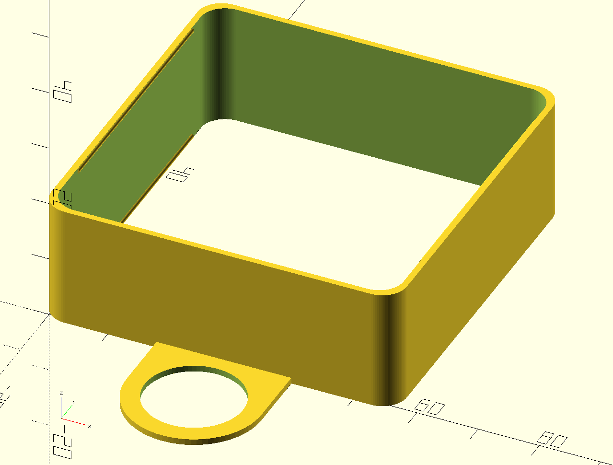
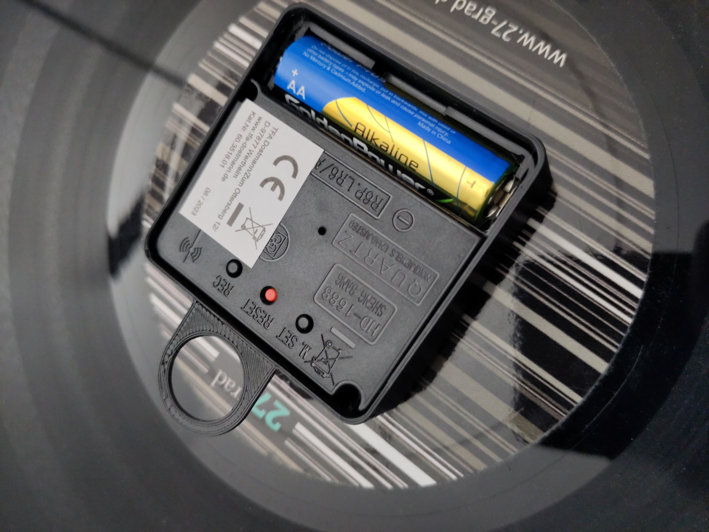
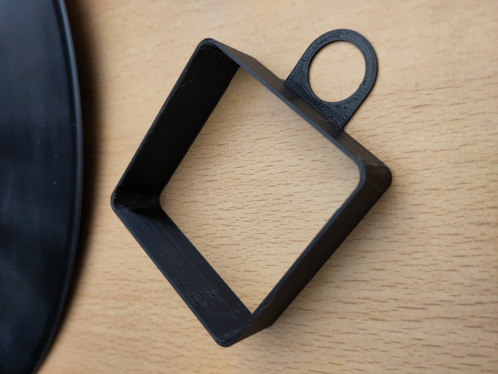

# Clockwork Frame Hanger

Frame Hanger for Clockworks with dimensions of 56mm x 56mm x 19mm.
Use OpenSCAD file to customize!

Frame just snaps onto clockwork. It is a bit loose. Better increase y by 1mm and decrease x by 1 mm (or 0.5mm).
This would lead to a better fit. But it holds.

 

 

# LICENSE

<dl>
 Dieses Werk ist lizenziert unter einer <a rel="license" href="http://creativecommons.org/licenses/by/4.0/">Creative Commons Namensnennung 4.0 International Lizenz</a>.
</dl>

<dl>
 This work is licensed under a <a rel="license" href="http://creativecommons.org/licenses/by/4.0/">Creative Commons Attribution 4.0 International License</a>.
</dl>
