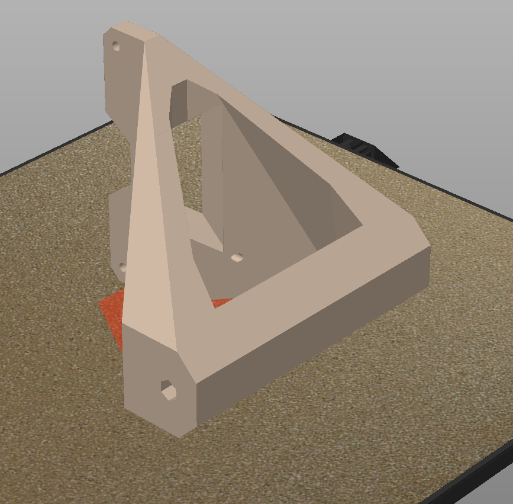

# SUP Fin Wagon

!!WIP!!

This is a addon for SUPs with US Box Fin System. With this it is possible to mount
tyres on the SUP an move it easily around.

OpenSCAD Script is also avaliable and can be changed and configured as needed.

Following sizes are avaiable as STLs:

- 120 090
  - 120mm long (inside fin box)
  - axis is 90mm away from of fin box
- 120 100
  - 120mm long (inside fin box)
  - axis is 100mm away from of fin box
- 140 090
  - 140mm long (inside fin box)
  - axis is 90mm away from of fin box
- 140 100
  - 140mm long (inside fin box)
  - axis is 100mm away from of fin box

 

# LICENSE

<dl>
 Dieses Werk ist lizenziert unter einer <a rel="license" href="http://creativecommons.org/licenses/by/4.0/">Creative Commons Namensnennung 4.0 International Lizenz</a>.
</dl>

<dl>
 This work is licensed under a <a rel="license" href="http://creativecommons.org/licenses/by/4.0/">Creative Commons Attribution 4.0 International License</a>.
</dl>
