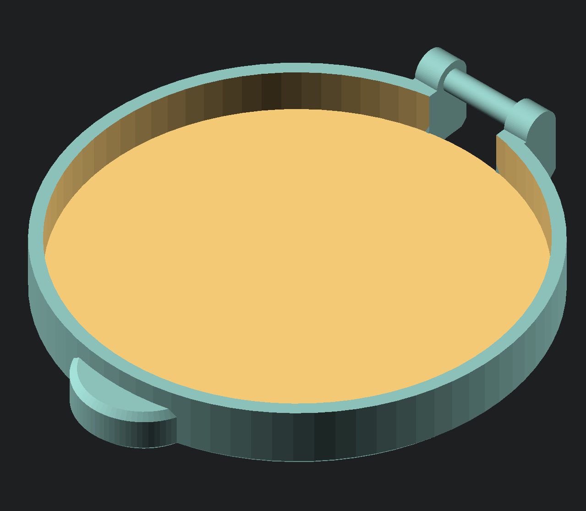
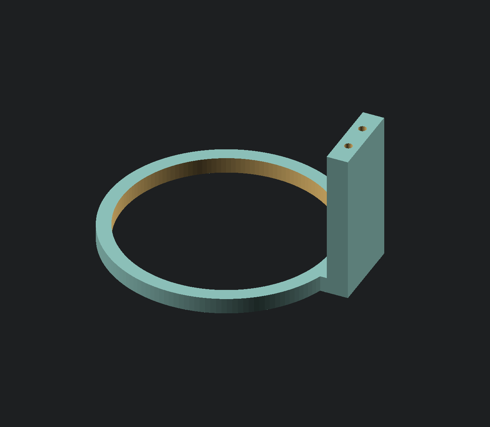

# __My Things Repository__

## This Repository contains some 3d models I made, which I don't put into a separate Repository

|No. | Thing             |  Image |
|:--:|:---------------:|:------:|
|001| Parametric Case or Box with snapable Lid||
|002| Parametric Round Cap ||
|003| Panel Wall Holder System !!!WIP!! ||
|004| Parametric Roller Blind Blend ||
|005| Brandson Vertical Blower Cable Holder ||
|006| Fan-Funnel ||
|007| LED Holder for Fan-Funnel ||
|008| Antenna Mount System ||
|009| Banana Cable Organizer with Lid ||
|00x| next thing is WIP! | |

 
 
 

# __Videos__

currently no videos

# LICENSE

<dl>
 Dieses Werk ist lizenziert unter einer <a rel="license" href="http://creativecommons.org/licenses/by/4.0/">Creative Commons Namensnennung 4.0 International Lizenz</a>.
</dl>

<dl>
 This work is licensed under a <a rel="license" href="http://creativecommons.org/licenses/by/4.0/">Creative Commons Attribution 4.0 International License</a>.
</dl>
